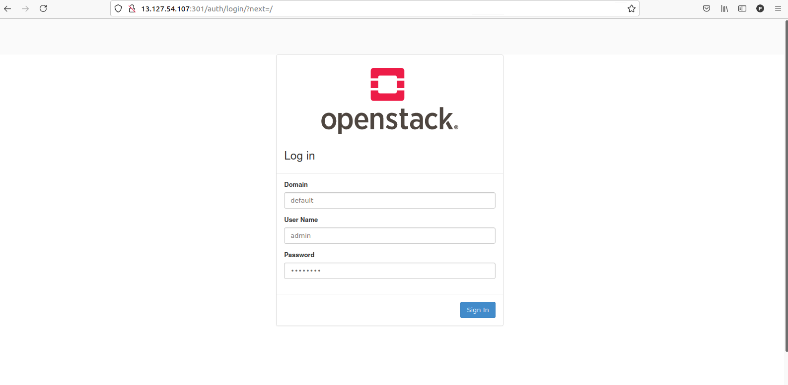

# Quick-Start

**Note: This demo is not a complete implementation.**

### Before you begin

To follow this demo, you need:

* A Kubernetes cluster with each node having minimum 8gb ram.

For this demo, we will use KinD tool to create cluster, although any Kubernetes cluster should work.

<details>
    <summary>Click here for KinD cluster creation instructions.</summary>
    <p>
    <b>Download Kind on linux:</b>
        <br>
        <code>curl -Lo ./kind https://kind.sigs.k8s.io/dl/v0.11.0/kind-linux-amd64</code><br>
        <code>chmod +x ./kind</code><br>
        <code>mv ./kind /bin/kind</code><br>
    </p><br>
    <p>
        <b>Now create cluster:</b><br>
        <code>kind create cluster --image kindest/node:v1.21.1</code>
    </p>
</details>


Note: You can try this demo in a VM on any public cloud like AWS, GCP, If you do not want to try on your system.


### Installing KupenStack

**Install crds**

First we need to install the required crds for Kupenstack.

```shell
kubectl apply -f https://raw.githubusercontent.com/Kupenstack/kupenstack/main/config/demo2/crds.yaml
```

**Create kupenstack-config**

Before deploying KupenStack we need to deploy its configurations as configmap into the cluster. The following is a sample configuration file:

```shell
kubectl apply -f https://raw.githubusercontent.com/Kupenstack/kupenstack/main/config/demo2/config.yaml
```

```yaml
apiVersion: v1
kind: ConfigMap
metadata:
  name: kupenstack-config
  namespace: kupenstack
data:
  config.yaml: |
    apiVersion: kupenstack.io/v1alpha1
    kind: KupenstackConfiguration
    metadata:
      name: configfile
    spec:
      defaultProfile:
        name: occp
        namespace: default
      # List of k8s nodes to disable for osk cluster.
      nodes:
        - name: kind-control-plane
          type: control,compute
```

This is a pretty straightforward configuration. Here we have said that the default OpenstackCloudConfiguration Profile is `occp` in the `default` namespace. We will discuss more on this next. But before that please note that KupenStack automatically creates a containerized Openstack cluster for us. For creating this cluster it assumes k8s control nodes to be openstack control nodes and k8s compute nodes to be openstack compute nodes. But we can override this behaviour. For example, in this sample configuration, we have configured to use k8s node named `kind-control-plane` as both control and compute. We can also disable certain nodes to be not used for deploying OpenStack cluster pods.

**OpenstackCloudConfiguration Profile**

We can configure OpenStack cluster using `OpenstackCloudConfigurationProfile`(Occp) Crds. An Occp is required before creating an OpenStack cluster.

```shell
kubectl apply -f https://raw.githubusercontent.com/Kupenstack/kupenstack/main/config/demo2/occp.yaml
```

```yaml
apiVersion: cluster.kupenstack.io/v1alpha1
kind: OpenStackCloudConfigurationProfile
metadata:
  name: occp
spec:
  keystone:
    replicas:
      api: 1
  glance:
    replicas:
      registry: 1
      api: 1
  horizon:
    disable: true
    replicas:
      server: 1
  nova:
    replicas:
      osapi: 1
      conductor: 1
      metadata: 1
    conf:
      ceph:
        enabled: false
      nova:
        libvirt:
          virt_type: qemu
          cpu_mode: none
  neutron:
    conf:
      neutron:
        DEFAULT:
          interface_driver: linuxbridge
      dhcp_agent:
        DEFAULT:
          interface_driver: linuxbridge
      l3_agent:
        DEFAULT:
          interface_driver: linuxbridge
  placement:
    replicas:
      api: 1
```

**Installing Kupenstack**

Now, as a final step, we can install KupenStack.

```shell
kubectl apply -f https://raw.githubusercontent.com/Kupenstack/kupenstack/main/config/demo2/kupenstack-controller-manager.yaml
```

As soon as Kupenstack starts it will first look at KupenstackConfiguration and k8s cluster to create required `OpenstackNode` objects. (Try `kubectl get osknodes`). Next, these various controllers in Kupenstack will try to spin up an Openstack cluster.

To look at the deployment while it is happening, try: `watch kubectl get pods -n kupenstack`. (On a machine with good compute and internet connection it should take about ~13mins)

Once deployment is complete. The output will look something like this: 

```
glance-api-7bcdc786b6-wktzr                    1/1     Running     0          41m
glance-bootstrap-hkhk7                         0/1     Completed   0          31m
glance-db-init-q95l8                           0/1     Completed   0          41m
glance-db-sync-6z7zj                           0/1     Completed   0          37m
glance-ks-endpoints-kphtm                      0/3     Completed   0          33m
glance-ks-service-dtd4q                        0/1     Completed   0          34m
glance-ks-user-vnncg                           0/1     Completed   0          33m
glance-metadefs-load-w99r2                     0/1     Completed   0          33m
glance-rabbit-init-jh76b                       0/1     Completed   0          36m
glance-storage-init-jzt4p                      0/1     Completed   0          32m
horizon-56b578d677-pzhfq                       1/1     Running     0          41m
horizon-db-init-fwkm2                          0/1     Completed   0          41m
horizon-db-sync-wb5hb                          0/1     Completed   0          41m
ingress-d5d8b9bdc-cz9lk                        1/1     Running     0          41m
ingress-error-pages-6d54c96946-jbb96           1/1     Running     0          41m
keystone-api-b4f58cdd9-pc6kr                   1/1     Running     0          41m
keystone-bootstrap-trqxz                       0/1     Completed   0          33m
keystone-credential-setup-pkd4p                0/1     Completed   0          41m
keystone-db-init-t7jxd                         0/1     Completed   0          38m
keystone-db-sync-6w448                         0/1     Completed   0          37m
keystone-domain-manage-qgh2c                   0/1     Completed   0          34m
keystone-fernet-setup-c9m2d                    0/1     Completed   0          37m
keystone-rabbit-init-94l7d                     0/1     Completed   0          36m
kupenstack-controller-678c66b58c-zrhwx         1/1     Running     0          42m
libvirt-libvirt-default-xpfbv                  1/1     Running     0          41m
mariadb-ingress-56bbb59f78-dqs8b               1/1     Running     0          41m
mariadb-ingress-error-pages-77c55c9cd7-c2klm   1/1     Running     0          41m
mariadb-server-0                               1/1     Running     0          41m
memcached-memcached-9978cc66c-gvnkd            1/1     Running     0          41m
neutron-db-init-bj986                          0/1     Completed   0          41m
neutron-db-sync-ks6v2                          0/1     Completed   0          37m
neutron-dhcp-agent-default-mpsjz               1/1     Running     0          41m
neutron-ks-endpoints-bkq2q                     0/3     Completed   0          33m
neutron-ks-service-8rs4t                       0/1     Completed   0          34m
neutron-ks-user-4v4nw                          0/1     Completed   0          33m
neutron-l3-agent-default-f27kz                 1/1     Running     0          41m
neutron-lb-agent-default-7pcj7                 1/1     Running     0          41m
neutron-metadata-agent-default-bd68j           1/1     Running     0          41m
neutron-netns-cleanup-cron-default-8gw4j       1/1     Running     0          41m
neutron-rabbit-init-fpln2                      0/1     Completed   0          37m
neutron-server-b56796d79-vhcl9                 1/1     Running     0          41m
nova-api-metadata-566785c56c-hdh6s             1/1     Running     2          41m
nova-api-osapi-66466bd88-b9b9p                 1/1     Running     0          41m
nova-bootstrap-xgfj2                           1/1     Running     0          41m
nova-cell-setup-9xthp                          1/1     Running     0          41m
nova-compute-default-fcz4z                     1/1     Running     0          41m
nova-conductor-56bf96fb47-bjnpr                1/1     Running     0          41m
nova-consoleauth-7989ff966b-pqmjr              1/1     Running     0          41m
nova-db-init-gm6jk                             0/3     Completed   0          41m
nova-db-sync-lp2lp                             0/1     Completed   0          37m
nova-ks-endpoints-bf2cp                        0/3     Completed   0          33m
nova-ks-service-df9cl                          0/1     Completed   0          34m
nova-ks-user-rv9wn                             0/1     Completed   0          33m
nova-novncproxy-5894489d56-grm7w               1/1     Running     0          41m
nova-rabbit-init-4xtp9                         0/1     Completed   0          34m
nova-scheduler-85d7f5d5bc-p2xsr                1/1     Running     0          41m
placement-api-694dccf9f-hvl7x                  1/1     Running     0          41m
placement-db-init-bf2h8                        0/1     Completed   0          41m
placement-db-sync-cm5jh                        0/1     Completed   0          41m
placement-ks-endpoints-tp2lb                   0/3     Completed   0          34m
placement-ks-service-dd8xp                     0/1     Completed   0          37m
placement-ks-user-hlswb                        0/1     Completed   0          35m
rabbitmq-cluster-wait-7k5h5                    0/1     Completed   0          41m
rabbitmq-rabbitmq-0                            1/1     Running     0          41m
```

Next we are ready to use Openstack in kubernetes:

### Create some resources

Let us create a Virtual Machine using KupenStack.

Apply following yaml file to Kubernetes:

```yaml
apiVersion: kupenstack.io/v1alpha1
kind: Image
metadata:
  name: image-sample
spec:
  src: http://download.cirros-cloud.net/0.5.1/cirros-0.5.1-x86_64-disk.img
  format: raw

---
apiVersion: kupenstack.io/v1alpha1
kind: Flavor
metadata:
  name: flavor-sample
spec:
  vcpu: 2
  ram: 500
  disk: 1
  rxtx: "1.0"

---
apiVersion: kupenstack.io/v1alpha1
kind: VirtualMachine
metadata:
  name: virtualmachine-sample
spec:
  image: image-sample
  flavor: flavor-sample
```

Apply:

```bash
kubectl apply -f https://raw.githubusercontent.com/Kupenstack/kupenstack/main/config/demo/vm-sample.yaml
```

### Know your deployment

Now, let us explore what we did.


* `kubectl get virtualmachines` this will show

```
NAME                    NODE                 STATE   AGE
virtualmachine-sample   kind-control-plane   BUILD   12s
```

Our Virtual machine is in build state, let us wait for some time and check again.


* `kubectl get vm -o wide`

```
NAME                    NODE                 STATE     NETWORKS(IP)            AGE
virtualmachine-sample   kind-control-plane   Running   default(10.10.1.190)    62s
```

Now, our Virtual machine is in running state. We can also see that VM is in `default` network and has IP `10.10.1.190` . Remember we have not deployed any networks. KupenStack by default keeps all VM in `default` network if network is not specified in VM Manifest. Since, we had not created any network called `default ` KupenStack automatically created it for us. We can check it by:

* `kubectl get networks`

```
NAME      IN-USE   AGE
default   true     56s
```


* `kubectl get flavors` gives us following output:

```
NAME            IN-USE   AGEflavor-sample   true     38s
```


* `kubectl get images` give us output:

```
NAME           IN-USE   READY   AGEimage-sample   true     true    43s
```

Note: our Image is in Ready state. It means it has been downloaded and uploaded to glance successfully.


* `kubectl get keypairs -o wide`

```
NAME             IN-USE   AGE     PRIVATE-KEYkeypair-sample   true     50s     keypair-sample-542zr
```

Note: we didn't specified any public key while creating key-pair so KupenStack automatically generated one and is exposing it through a secret. We can copy our private-key from this secret and then delete this secret.


* If we look at our Namespaces, then we can see there are annotations for corresponding Project in OpenStack. For example: `kubectl describe ns default` give us:

```
Name:         defaultLabels:       <none>Annotations:  kupenstack.io/external-project-id: 4c7c184c14314cb08244a1fcc47d0bf5              kupenstack.io/external-project-name: default-5fg8kStatus:       ActiveNo resource quota.No LimitRange resource.
```

In the annotations we can see a Project named `default-5fg8k` has been created in OpenStack which maps to this Namespace in Kubernetes. Every resource that is created in this Namespace will be created in corresponding Project at OpenStack.


We can cross-verify our above deployments in Horizon also, Go to port `32020 ` on the node's ip in browser:

Now, you can login and check, (Credentials are: Domain: "default", user: "admin", password: "password")


